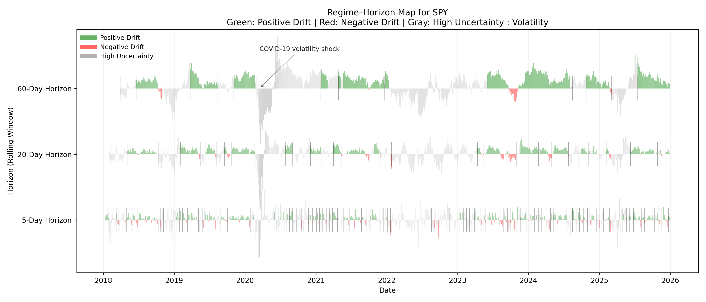

# Regime–Horizon Map: Multi-Scale Market Regime Visualization for SPY

## Overview

This repository contains the implementation of a **Regime–Horizon Map**, a custom data visualization technique designed to analyze **market regimes across multiple temporal horizons** using financial time-series data. The visualization is applied to the SPDR S&P 500 ETF (SPY).

Traditional financial visualizations (e.g., price charts, moving averages, or single-horizon volatility plots) typically focus on **one temporal scale at a time**. However, during market stress or regime shifts, short-term signals often behave very differently from long-term trends. This project explores whether such differences can be made visible within a **single, unified visual representation**.

The Regime–Horizon Map addresses this by simultaneously encoding **trend direction, uncertainty, and temporal scale**, enabling comparison of regime persistence and transition timing across horizons.

## Visualization Technique: Regime–Horizon Map

### Core Idea

The Regime–Horizon Map combines:
- **Multiple rolling horizons** (5-day, 20-day, 60-day),
- **Regime classification** based on rolling mean and volatility,
- **Uncertainty-aware encoding** using opacity,
- **Explicit regime transition markers**.

Each horizontal band represents a different rolling window (horizon), while time is shared across all bands on the x-axis. This allows direct comparison of how market regimes emerge, stabilize, or dissolve across different temporal scales.

### Visual Encoding

- **Vertical position**: Rolling horizon (5-Day, 20-Day, 60-Day)
- **Color (hue)**:
  - Green → Positive drift (bullish regime)
  - Red → Negative drift (bearish regime)
  - Gray → High uncertainty (elevated volatility)
- **Opacity**: Magnitude of volatility (higher opacity = greater uncertainty)
- **Transition ticks**: Debounced markers indicating meaningful regime changes, primarily when entering or exiting high-uncertainty states

This encoding choice follows principles discussed in the DV regarding **channel expressiveness, discriminability, and uncertainty visualization**.

## The Novelty Point

While horizon graphs and regime plots exist independently, this approach differs in three important ways:

1.Instead of switching between charts, all horizons are visualized concurrently, supporting comparative reasoning across time scales.

2.Volatility is not shown as a separate line or indicator, but is embedded directly into the visual encoding via opacity.

3. Debounced transition markers allow analysts to reason about *when* regime changes occur and *which horizon detects them first*.

As a result, the Regime–Horizon Map supports analytical questions that are difficult to answer with standard financial charts, such as:
- *Which regimes persist across horizons?*
- *How early do short-term horizons react compared to long-term trends?*
- *How does uncertainty propagate across time scales?*

## Data Source 

To ensure the project **runs without modification**, the implementation follows an **offline-first design**.

- Market data is downloaded once from **Stooq** .
- A cached CSV file is saved locally and committed to the repository.
- All subsequent runs load data from the cache, ensuring reproducibility even without internet access.

## Sample Output

Below is an example of the Regime–Horizon Map generated by this project using SPY data (2018–2026).

**Figure description:**  
Each horizontal band represents a different rolling horizon (5-day, 20-day, and 60-day).  
Color encodes the inferred market regime (green = positive drift, red = negative drift), while opacity reflects volatility-based uncertainty.  
Vertical tick marks indicate debounced regime transitions, highlighting the timing of major uncertainty shifts across horizons.

